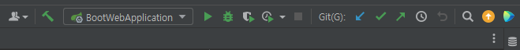

# Spring-Boot-Web-Kotlin

#### 1. Edit Configuration -> "BootWebApplication"

#### 2. Click 'Execute' button

#### 3. Click "HERE" below, to access into localhost:8080
start from [HERE](http://localhost:8080)

#### Screenshot
Three images can be found in [HERE](https://github.com/Gaon-Choi/Spring-Boot-Kotlin/tree/main/04_Spring-Boot-Web-Kotlin/screenshots)
